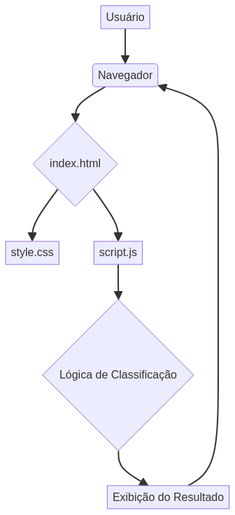

# Classificador de Nível de Herói 🦸‍♂️🧠

## Diagrama de Arquitetura




## 🇧🇷 Português


### Sobre o Projeto

Este é um mini projeto prático desenvolvido como parte da jornada de aprendizado em lógica de programação na DIO. O objetivo é aplicar conceitos fundamentais como variáveis, operadores, estruturas de decisão e laços de repetição em um contexto divertido: classificar o nível de heróis com base na quantidade de experiência (XP).

### Objetivo

Criar uma aplicação simples capaz de classificar heróis de acordo com sua pontuação de XP, exibindo mensagens como:

> "O Herói de nome **Ayla** está no nível de **Ascendente**"

A lógica de classificação segue o seguinte critério:

| Nível       | XP Necessária |
| :---------- | :------------ |
| Ferro       | < 1.000       |
| Bronze      | 1.001 - 2.000 |
| Prata       | 2.001 - 5.000 |
| Ouro        | 5.001 - 7.000 |
| Platina     | 7.001 - 8.000 |
| Ascendente  | 8.001 - 9.000 |
| Imortal     | 9.001 - 10.000|
| Radiante    | 10.001+       |

### 🛠️ Tecnologias Utilizadas


- HTML5
- JavaScript
- CSS

### Estrutura do Projeto

- `src/index.html`: Interface principal com formulário para entrada de nome e XP do herói.
- `src/script.js`: Contém a lógica de classificação e exibição dinâmica dos resultados.
- `src/style.css`: Estilização básica para uma interface amigável.

### Como Testar o Projeto

1.  Clone o repositório:
    ```bash
    git clone https://github.com/galafis/Classificador-de-Nivel-de-Heroi.git
    ```
2.  Navegue até o diretório do projeto:
    ```bash
    cd Classificador-de-Nivel-de-Heroi
    ```
3.  Abra o arquivo `docs/index.html` em seu navegador web preferido.
4.  Digite o nome do herói e a quantidade de XP no formulário.
5.  Observe o nível do herói ser exibido na tela.

### Por que este projeto é importante?

Este exercício, apesar de sua simplicidade, é fundamental para solidificar conceitos de lógica de programação. Ele oferece uma abordagem prática para desenvolver o pensamento computacional, essencial para estudantes de Ciência de Dados, Engenharia de Software e áreas correlatas.

### Próximos Passos (Sugestões de Melhoria)

- Integração com banco de dados para persistência de dados de heróis.
- Desenvolvimento de uma API para classificação de heróis.
- Criação de uma plataforma com rankings e perfis de heróis.

### Contribuição

Sinta-se à vontade para fazer um fork do projeto, contribuir com melhorias ou adaptá-lo às suas necessidades. A prática contínua é a chave para o aprendizado!

---

## 🇬🇧 English


### About the Project

This is a practical mini-project developed as part of my learning journey in programming logic at DIO. The goal is to apply fundamental concepts such as variables, operators, decision structures, and loops in a fun context: classifying hero levels based on their experience points (XP).

### Objective

Create a simple application capable of classifying heroes according to their XP score, displaying messages such as:

> "The Hero named **Ayla** is at **Ascendant** level"

The classification logic follows the criteria below:

| Level       | Required XP   |
| :---------- | :------------ |
| Iron        | < 1,000       |
| Bronze      | 1,001 - 2,000 |
| Silver      | 2,001 - 5,000 |
| Gold        | 5,001 - 7,000 |
| Platinum    | 7,001 - 8,000 |
| Ascendant   | 8,001 - 9,000 |
| Immortal    | 9,001 - 10,000|
| Radiant     | 10,001+       |

### 🛠️ Technologies Used


- HTML5
- JavaScript
- CSS

### Project Structure

- `src/index.html`: Main interface with a form for hero name and XP input.
- `src/script.js`: Contains the classification logic and dynamic display of results.
- `src/style.css`: Basic styling for a user-friendly interface.

### How to Test the Project

1.  Clone the repository:
    ```bash
    git clone https://github.com/galafis/Classificador-de-Nivel-de-Heroi.git
    ```
2.  Navigate to the project directory:
    ```bash
    cd Classificador-de-Nivel-de-Heroi
    ```
3.  Open the `docs/index.html` file in your preferred web browser.
4.  Enter the hero's name and XP amount in the form.
5.  Observe the hero's level displayed on the screen.

### Why is this project important?

This exercise, despite its simplicity, is fundamental for solidifying programming logic concepts. It offers a practical approach to developing computational thinking, essential for students of Data Science, Software Engineering, and related fields.

### Next Steps (Improvement Suggestions)

- Database integration for hero data persistence.
- Development of an API for hero classification.
- Creation of a platform with hero rankings and profiles.

### Contribution

Feel free to fork the project, contribute improvements, or adapt it to your needs. Continuous practice is the key to learning!

---

## Licença

Este projeto está licenciado sob a [Licença MIT](LICENSE).

## License

This project is licensed under the [MIT License](LICENSE).

---

Feito com dedicação por Gabriel Demetrios Lafis 💻

Made with dedication by Gabriel Demetrios Lafis 💻

